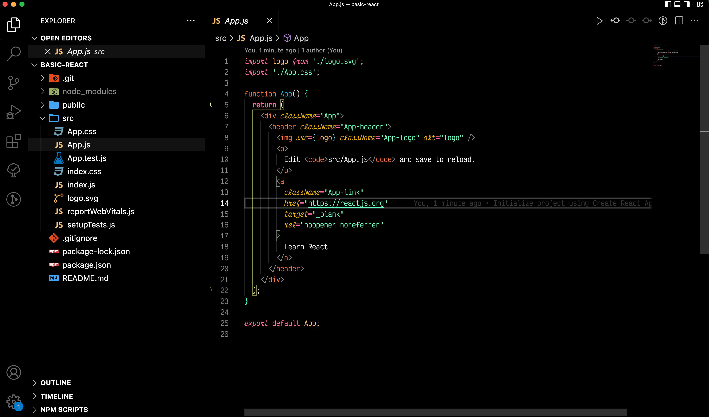
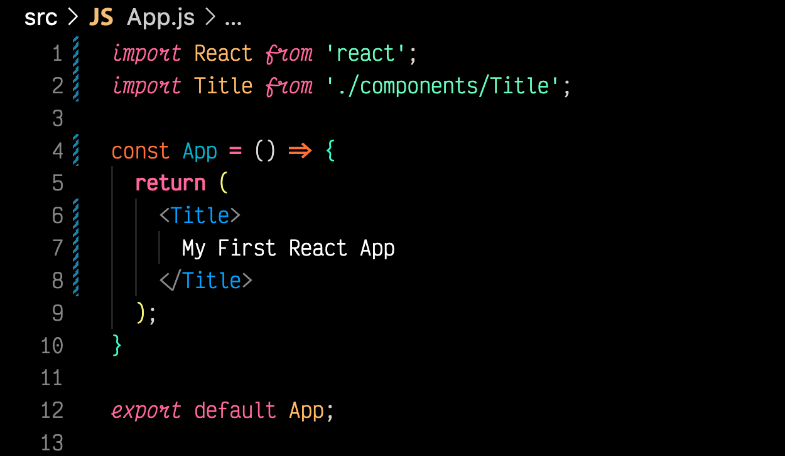

<div>
  <h1
    style="border: none; padding: 0; margin-bottom: 0; font-size: 3rem;"
  >
    Getting Started with ReactJS
  </h1>
  <h3 style="margin: 0.5rem 0;">
    Author: Nathan Lauder <br/>
    Date: April 19, 2022
  </h3>
</div>

---


With the push to using front end frameworks and the utilization of JavaScript on the front end, [ReactJS](https://reactjs.org/) has emerged as a leader in design and UI/UX for many companies.  Through the use of JSX, React allows developers to create reusable components to help with dynamic web pages.  In this document, I will walk through a quick start up with React to get started with a first project!

## What You'll Need

I will be using a Mac for this project, so keep that in mind.  This is all platform independent, but some substitutions may be necessary for some specific cases.

### Tools
1. The latest *recommended* version of [NodeJS](https://nodejs.org/en/)
2. Your IDE or text editor of choice-I use VSCode

### Knowledge

1. Knowledge of HTML and CSS
2. A solid understanding of JavaScript
3. Comfortability with using terminal

## Setting Up the Project

After installing NodeJS, we can setup the project using the install script provided.  Open terminal and navigate to the folder where you want the application to be kept.  After you have found that location, run the following command and wait for the necessary packages to install:

```shell
$ npx create-react-app name-of-your-app
$ cd name-of-your-app
```

This will create the `name-of-your-app` folder in the current directory as a React project and move you into that folder.  You should see a file structure like the image below.



1. `.git/` holds the git information
2. `node_modules/` contains package information used in the project
3. `public/` holds all the public files like `index.html ` and the favicon
4. `src/` has all the src folders
    1. `App.*` renders and styles the highest level of the app
    2. `index.*` renders and styles the App files
    3. `logo.svg` is the React logo
    4. *The other files are used by React for other purposes, which are more advanced than the scope of this tutorial*
5. `.gitignore` specifies the files ignored by git
6. `package-lock.json` and `package.json` contain the dependencies and version information of the app we are making.  **DO NOT DELETE `package.json`** or the dependency information will have to be manually recovered.
7. `README.md` is a default README from React

With a good understanding of the file structure, it is time to run the app. To ensure the project is properly setup we can run it by triggering the react-script.

```shell
$ npm run start
```

This will start a hot-reload server on the default browser of the machine using Node Package Manager.  You should see the home screen of the react project, and that is the initial setup of a React project.


## Creating Components

We now want to create our own components to customize the application for our uses.  Based on the current structure we can utilize a component-based structure with the `styled-components` library.  Run the following commands to set these up.

```shell
$ npm i styled-components # can also use 'install'
$ mkdir src/components
$ touch src/components/Title.jsx
```

Styled components may reveal some vulnerabilities in the package, but we will ignore those for now. Because this file will export a JSX component, it is good practice to name it with a `.jsx` extension and import react to the scope of the file. To utilize the `styled-components` package, we will import it using ES6 syntax.  These lines should appear at the top of `Title.jsx`.

```js
import React from 'react'; // not necessary, but good practice
import styled from 'styled-components';
```

Next, we define the component as a styled h1 element. Within the backticks, we can write whatever CSS style we want which will apply to the h1. We will also export it as the default export.

```js
const Title = styled.h1`
  color: red;
  margin: 2rem auto;
`;

export default Title;
```

Now we can implement the defined component:
1. Navigate back to the `App.js` file and import the new component
2. Delete all content from return statement
3. Add the Title component in the return



This new `App.js` file will render a blank page with the centered title.


And there is the Title component rendered on the main page of the project. As a side note, the `styled-components` package allows styling on any HTML element. The syntax format is the same as previously used following the below template.

```js
const variableName = styled.ELEMENT_NAME``;
```

## Using Props

Props create the ability to render dynamic content in a component by passing them through the component as a prop value. The Title component could be redefined to accept incoming props to render the title.  The below code would render the same page if we were to redefine the `Title.jsx` component.

```js
<Title title="My First React App" />
 
// could also pass a variable name
const pageTitle = "My First React App";
<Title title={pageTitle} />
```

As mentioned, the Title component will need to be redefined to accept this prop. In this case, it will be a functional component that takes parameters through and arrow function. Any syntax for a function will work as long as it follows the same functionality in JavaScript.

```js
const TitleText = styled.h1`
  color: red;
  text-align: center;
`;

// destructure props object to explicitly define incoming props
// could also just accept the props parameter with (props)
const Title = ({ pageTitle }) => {
  return (
    <TitleText>
      {pageTitle} // or {props.pageTitle}
    </TitleText>
  );
};

export default Title;
```

Many linters dislike the format of the Title component only containing a return statement.  To fix that, through the power of arrow functions, it can simply shorthand return the JSX like so.

```js
const Title = ({ pageTitle }) => (
  // JSX inside return statement
); 
```

## Hooks

Hooks are a great way to interact with the React lifecycle and state.  For additional hook information, ReactJS has a great description on [their website](https://reactjs.org/docs/hooks-overview.html#but-what-is-a-hook).  For now, we can focus on using hooks in code using a new component in `src/components/` called `ButtonHook.jsx`.  In that file: 
1. Import `React` and `styled`
2. Define the function with no props
3. Export `ButtonHook` as the default

Next, import useState, which is not a default export (must destructure), from the react package. We can define and initialize a count variable and setter function in one line.

```js
import React, { useState } from 'react';
import styled from 'styled-components';

// All JSX must have one parent element. This will wrap all JSX
const Wrapper = styled.div`
  text-align: center;
`;

const ButtonHook = () => {
  const [count, setCount] = useState(0);

  return (
    <Wrapper>
      <div>Clicked count: {count}</div>
      <button onClick={() => setCount(count+1)}>
        Click me!
      </button>
    </Wrapper>
  );
};

export default ButtonHook;
```

The button's `onClick` statement works the same as a normal `onclick`, but it must be called through an arrow function to minimize re-renders of the component.  Update `App.js` to include the ButtonHook element:

```js
import ButtonHook from './components/ButtonHook';
// ...previous code as before
=> (
  // a JSX fragment which acts like a normal div as a parent element
  <>
    <Title pageTitle="My First React App" />
    <ButtonHook />
  </>
);
```

There are other hooks provided by React such as the `useEffect()` hook which can be further explored.  For the purposes of this tutorial as an introduction, that will not be covered.

The final code for this introduction can be found on github in the [basic-react-tutorial](https://github.com/nathanlauder/basic-react-tutorial) repository on GitHub.